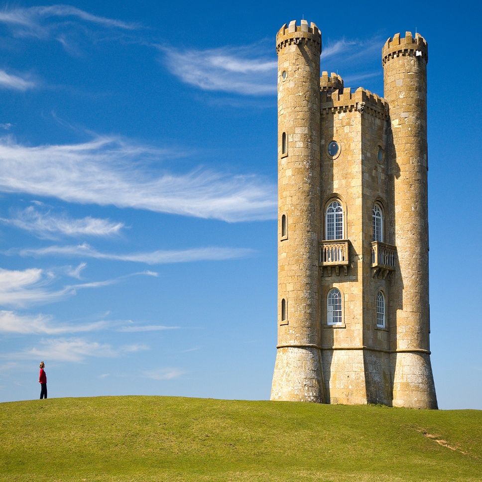
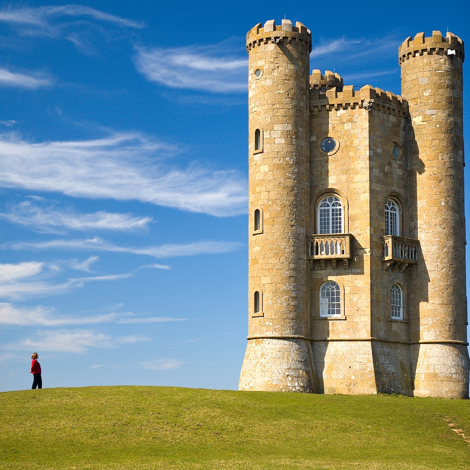
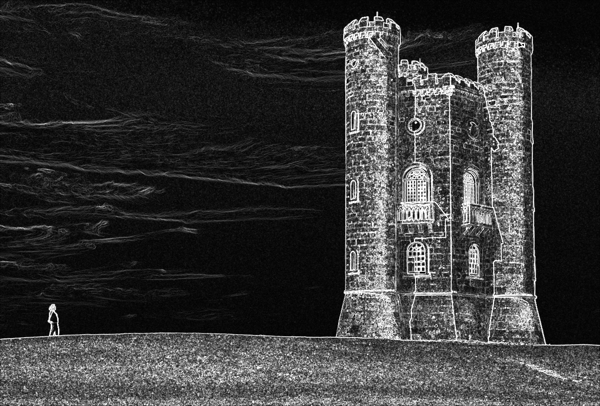
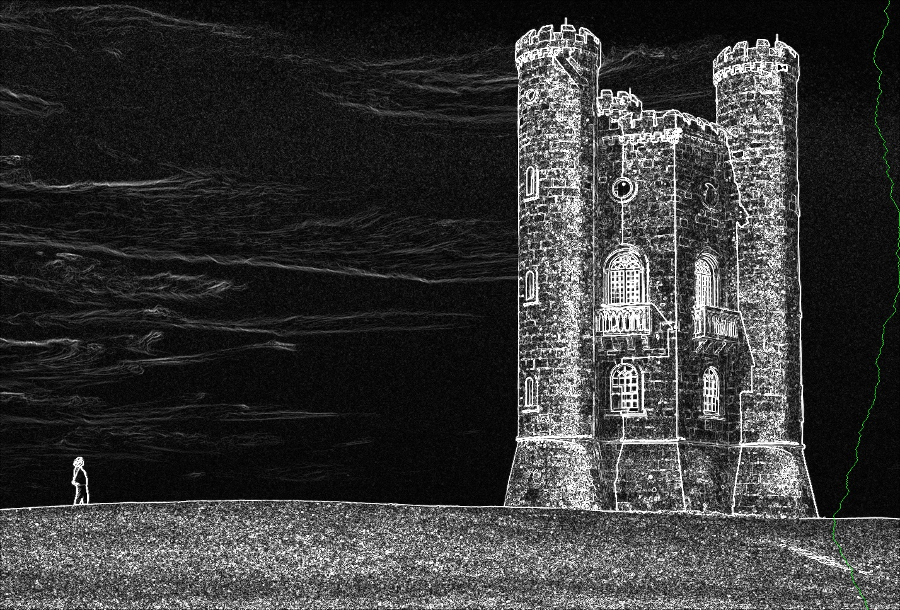
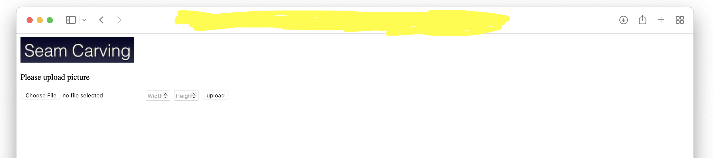

# python seam-carving
Seam Carving in python, and it comes with a flask application! Original paper: [Seam Carving for Content-Aware Image Resizing](http://www.faculty.idc.ac.il/arik/SCWeb/imret/index.html)

## What does it do?
Seam carving is an image processing algorithm for content-aware image resizing. Simply put, it can resize images without distorting important objects.

Demonstration:
| image | original (1428x968) | resized (968x968)  |
| --- | --- | --- |
| simple resize | |  |
| seam carving |  |  |

## How does it work?
Consider resizing the above image from `1428x968` to `1427x968` for the moment. We first calculate a floating-point score for each pixel in the image. It represents the importance of that pixel as shown below. The brighter the pixel, the more important it is.



And then, all we have to do is to find a path or a **seam** from top to bottom which accumulates to the minimum score and remove every pixel along that seam. In this case, it is the highlighted green seam.



Repeat this process a couple of times, we will be able to resize the image from `1428x968` to `968x968` without doing much damage to the content of the image.


As you might have noticed by now, the most important contribution of the seam carving paper is that it provides a way to evaluate the "importance" (called the energy) of each pixel in the image. And since the paper was published, many other evaluation algorithms have been proposed.

In this project, I use the original method of the paper. It is two [Sobel filters](https://en.wikipedia.org/wiki/Sobel_operator), one for the verticle direction, and the other one for the horizontal direction. Together they show how much different a pixel is from the surrounding pixels. The dissimilar the pixel, the higher the energy score.

One obvious disadvantage of Seam Carving is that it runs insanely slow. On CPU with no optimization, it takes 42 seconds to process one image. That's where CUDA comes in. CUDA enables developers to run general-purpose programs on and harness the great parallel computing power of NVIDIA GPUs. With CUDA acceleration, I was able to reduce the processing time to 0.5 seconds! For more information about my hardware setup please refer to the [Comparison of speed](#comparison-of-speed) section.

## Quick start
```bash
# install python packages
python3 -m pip install -r requirements.txt
# see usage
python cml_ui.py -h
# example run
# the result image is save as res.jpg
python cml_ui.py -r 512 -c 700 images/rem.jpeg
```

And it comes in flask flavor!
```bash
python web_ui.py
```

and then go to `http://127.0.0.1:10800/` in your favorite browser




## Comparison of speed
I use Linux `time` program to measure the time consumed. Each version is tested with the following command:

```bash
time python cml_ui.py images/rem.jpeg -r 400 -c 600
```

My hardware setup:
- CPU: `AMD Ryzen 7 5800H (16-core)`
- GPU: `NVIDIA GeForce RTX 3080 Ti`
- another GPU: `NVIDIA GeForce RTX 3090`

Results:
### GPU (3090)
```
real    0m0.564s
user    0m0.506s
sys     0m1.246s
```

### GPU (3080 Ti)
```
real    0m1.763s
user    0m1.702s
sys     0m4.742s
```

### CPU fast (numba)
```
real    0m10.509s
user    0m14.076s
sys     0m9.695s
```

### CPU slow
```
real    0m42.481s
user    0m45.133s
sys     0m4.929s
```
